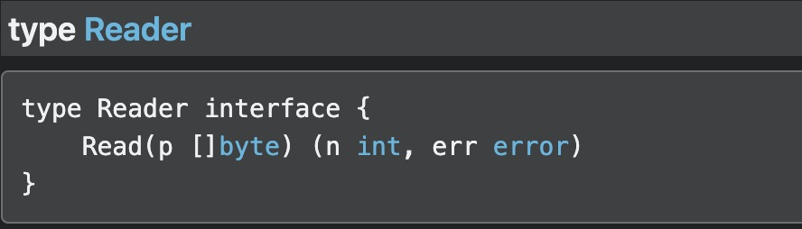
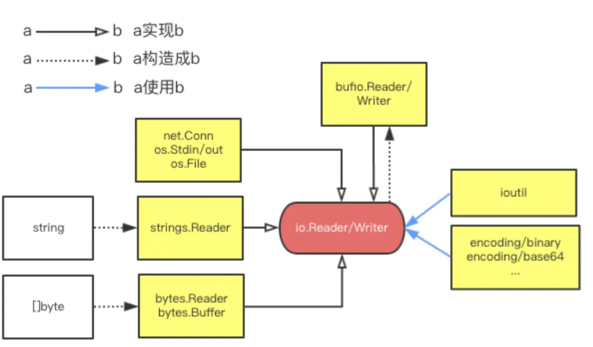
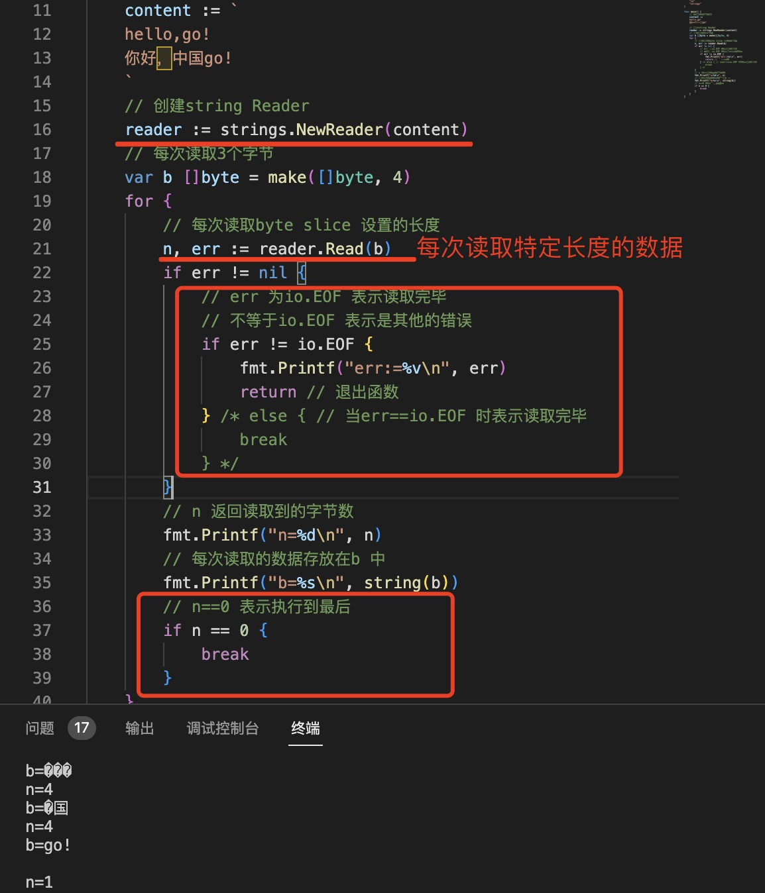

1. io.Reader: 

   

   Read 方法`每次读取`[]byte 切片设置的长度的字节数，并存入到p 中，如果使用for 循环读取数据，当读取完毕，error 返回io.EOF,并且n=0

2. 在go 标准库中实现了Reader 接口的有很多，比如file 读取文件，字符串操作，标准输入，网络连接，字节读取等

   

+ string 字符串Reader， 在strings 包中

   

+ bytes.Reader 

+ net.Conn 对象Read

+ os.File

+ os.Stdout/os.Stdin
