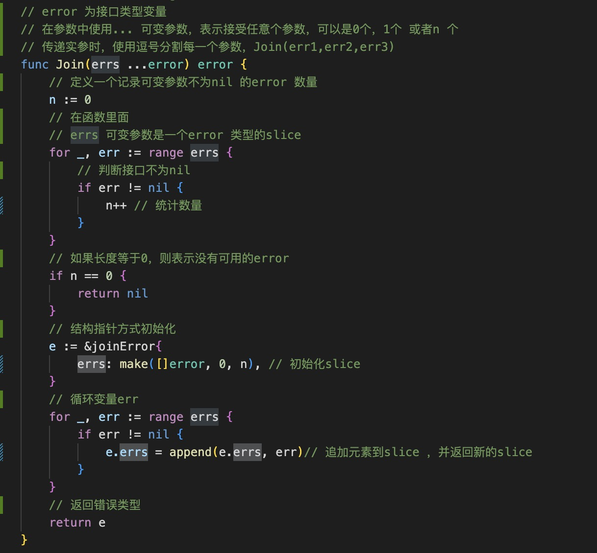

1. error 是go 内置的接口类型， 定义了一个Error() string 方法，只要实现了这个方法都认为是实现了error 接口

2. error.New() 创建error

   

3. error.Join(err ...error) ： 合并输出多个错误，使用\n 分割每个错误信息

   

   joinError 在package 在package 中使用小写字母开头，不对外公开，只用于package 内部

   

   