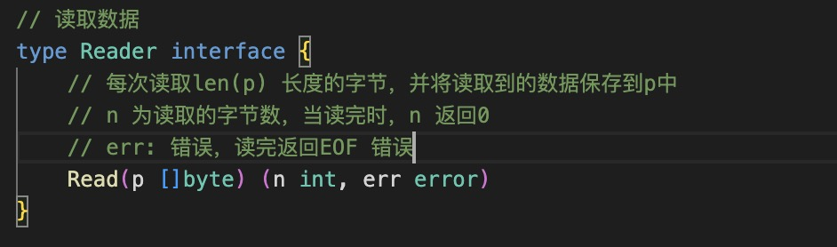
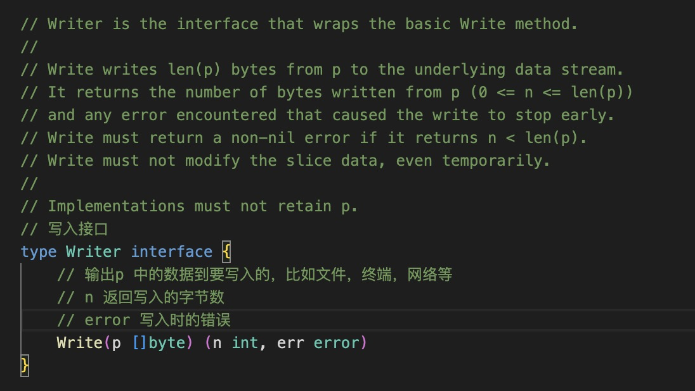

1. io 是go 标准的输入(input)和输出(output) 库

   主要包含Reader 和 Writer 接口

+ Reader: 读取数据

   

+ Writer : 输出数据

   

2. 在go 语言标准库中实现了 Reader 和 Writer 接口的库

+ string: 在strings 库中，strings.NewReader(str)

+ bytes.Buffer

+ file:文件

+ http

   ```go
   func myHandler(w http.ResponseWriter, r *http.Request) {
     // http.ResponseWriter
      w.Write([]bytes("Hello World"))
   }
   ```

+ 网络连接Conn

+ os.Stdin/os.StdOut

