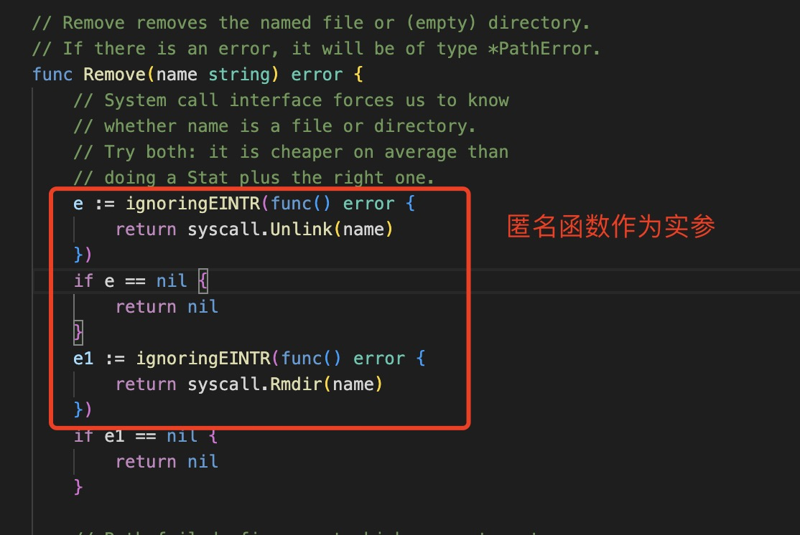

1. 在go 语言中，函数是一等公民，类似于JavaScript中的函数，函数可以作为类型，可以作为参数，可以作为返回返回值等

+ 函数类型：只有方法的声明，没有具体实现

  比如：go 基础库中Append 函数

  ```go
  // 函数类型声明
  func append(slice []Type, elems ...Type) []Type
  ```

+ 函数类型作为变量

+ 函数类型作为参数

+ 返回值为函数类型

2. 匿名类型函数：没有函数名称的函数

+ 作为函数类型变量的值

+ 立即执行函数

+ 作为实参传递给函数

  

+ 作为函数返回值